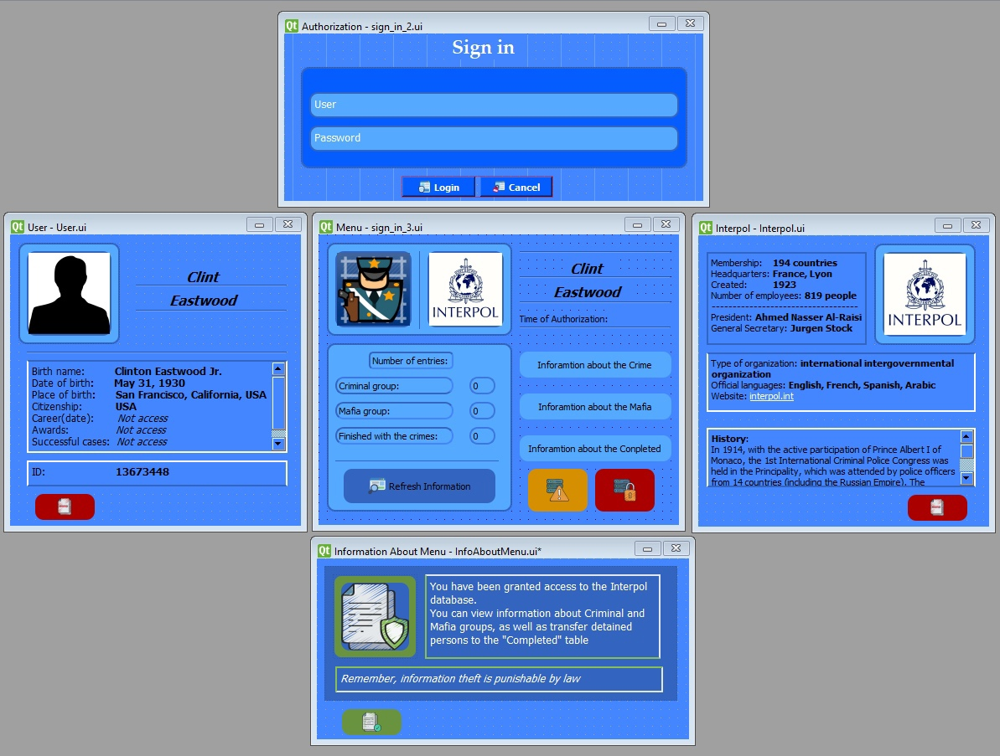

The program uses a local database for keeping information about some criminal elements, such as mafia, crime people, and completed action of any criminal elements.

GUI was made in framework QT (qt designer) + CSS and used object oriented language Python with library PyQt5.  

Used a database - MySQL with request language SQL.

Main Menu:

Windows of data base:

